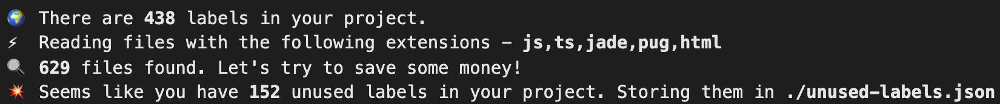

# 🕵🏻‍♂️ Unused Labels (unsd)

Find out which labels are not being used in your project.



## Usage

```
npx unused-labels --src labels.yaml --dir dir/to/scan
```

* **src** - source file (yaml)
* **dir** - directory to scan